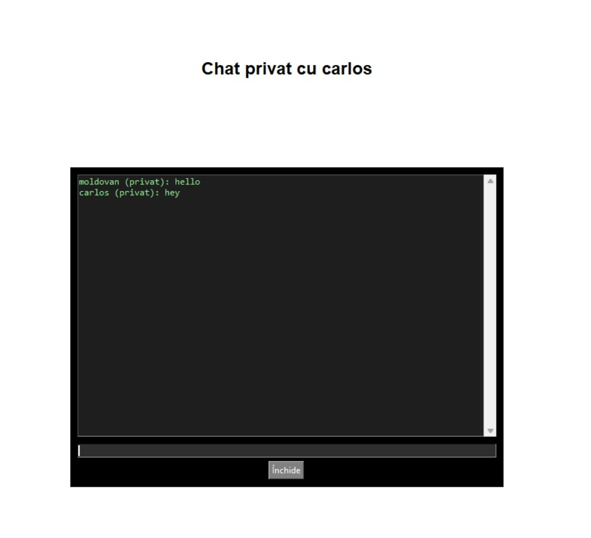

# CHAT CRYPTAT

Acest proiect este un chat scris în Python care permite comunicare în timp real între utilizatori, cu criptare AES aplicată pe mesajele trimise. Proiectul vine cu o interfață grafică (Tkinter), unde utilizatorii pot selecta între chat de grup sau privat și pot trimite mesaje în siguranță.

## Scopul proiectului

Scopul acestui proiect este să ofere o soluție simplă și eficientă pentru comunicarea criptată între mai mulți utilizatori, într-un mediu controlat și accesibil. Prin această aplicație, se pot simula două tipuri de scenarii de comunicare. Primul este un chat de grup, în care toți utilizatorii conectați pot trimite și primi mesaje într-un flux comun, replicând o conversație publică. Al doilea scenariu este cel al comunicării directe între doi utilizatori, unde mesajele sunt trimise în mod privat, iar criptarea asigură că doar destinatarul le poate citi.

Această dublă funcționalitate permite atât explorarea tehnicilor de transmitere a datelor în rețea, cât și înțelegerea modului în care se pot proteja aceste date împotriva accesului neautorizat. Proiectul pune accent pe învățare practică, fiind ideal pentru cei care vor să aprofundeze noțiuni de criptografie, programare orientată pe rețea și dezvoltare de aplicații cu interfață grafică în Python.

Aplicația își propune să protejeze confidențialitatea comunicării dintre utilizatori prin criptarea tuturor mesajelor folosind algoritmul AES, una dintre cele mai cunoscute și utilizate forme de criptare simetrică. Astfel, orice mesaj transmis este criptat la sursă și poate fi decriptat doar de către destinatar, asigurând un nivel de bază al securității datelor schimbate între clienți.

Pe lângă componenta de securitate, aplicația oferă o interfață grafică clară și ușor de folosit, construită cu ajutorul bibliotecii Tkinter. Designul a fost gândit astfel încât utilizatorii să poată interacționa cu aplicația într-un mod intuitiv, fără a avea nevoie de cunoștințe tehnice avansate.

Aplicația inițiază un server care ascultă conexiuni pe portul `1540` și permite conectarea simultană a mai multor clienți, gestionând eficient traficul prin threading. La conectare, fiecare client este nevoit să introducă o parolă prestabilită, configurată direct pe server, pentru a putea accesa funcționalitățile aplicației.

După autentificare, utilizatorii au la dispoziție două moduri principale de comunicare: fie intră într-un chat de grup, unde toate mesajele sunt partajate cu toți ceilalți utilizatori conectați, fie aleg un interlocutor specific pentru a purta o conversație privată, unul-la-unul. Mesajele trimise sunt criptate folosind algoritmul AES, iar decriptarea are loc pe server înainte de afișare, asigurând astfel un canal de comunicare criptat end-to-end.

Toate mesajele sunt afișate în timp real în interfața clientului, fără întârzieri sau blocaje, datorită utilizării firelor de execuție (threading) care rulează în paralel cu UI-ul aplicației. Această abordare permite utilizatorilor să primească și să trimită mesaje într-un mod fluid, fără ca interfața grafică să înghețe în timpul procesării datelor.

---

## Interfață și Funcționalitate

### Login simplu
Autentificare cu username și parolă:  

### Selectare mod de comunicare 
Alegere între chat de grup sau privat:  

### Chat de grup 
Toți utilizatorii conectați pot comunica într-un singur spațiu:  

### Chat privat 
Comunicare individuală între doi utilizatori, cu selecție din listă:  

---

## Cum se folosește

Pentru a utiliza aplicația, asigură-te mai întâi că ai instalat Python 3 pe sistemul tău. După aceea, este necesar să instalezi biblioteca **PyCryptodome**, care se ocupă de criptarea mesajelor. Aceasta poate fi adăugată cu ușurință folosind `pip`, managerul de pachete Python.

Odată ce biblioteca este instalată, aplicația poate fi pornită. Serverul trebuie lansat primul, prin rularea fișierului `server.py`. Acesta va asculta conexiunile venite de la utilizatori pe portul prestabilit.

Pe fiecare dispozitiv client de pe care dorești să te conectezi, pornește aplicația rulând fișierul `user.py`. La conectare, utilizatorul va introduce un nume și parola definită în codul serverului. Dacă parola este corectă, va avea acces la funcționalitate.

După autentificare, utilizatorul poate alege între două moduri de comunicare: fie intră într-un chat de grup unde vede mesajele tuturor, fie selectează un alt utilizator pentru a începe un chat privat. Comunicarea se desfășoară printr-o interfață grafică simplă și intuitivă, iar mesajele sunt criptate automat pentru a proteja conținutul transmis.

---

## Librării folosite

- `socket` – pentru conexiuni rețea  
- `threading` – pentru execuție paralelă  
- `tkinter` – pentru interfața grafică  
- `Crypto.Cipher (AES)` – pentru criptare și decriptare  
- `hashlib` – pentru hashingul parolei  
- `pickle` – pentru serializarea datelor  

---

## Surse și inspirație

- https://docs.python.org/3/library/socket.html  
- https://docs.python.org/3/library/tkinter.html  
- https://youtu.be/GYCVmMCRmTM?si=7N5uViP4ksaLexpG
